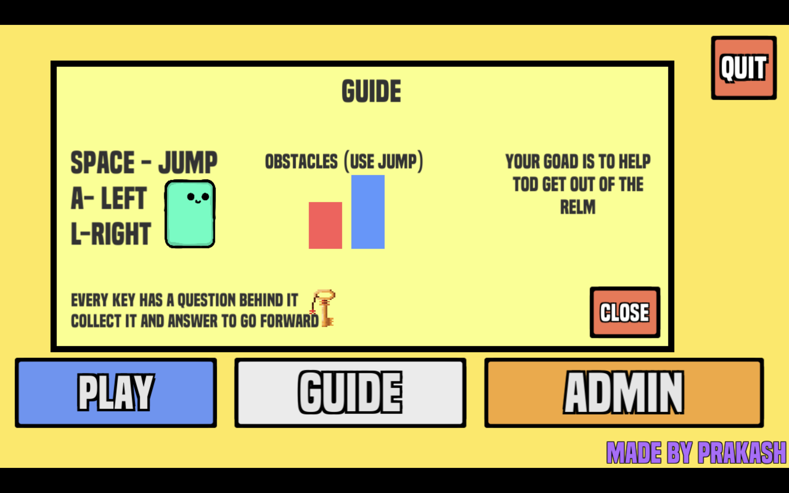
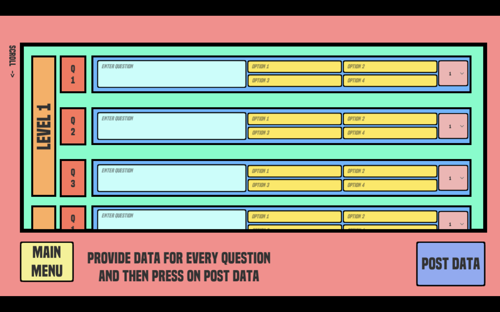

# https://proprak01.itch.io/quaxi-edu-game

## This is a game made in unity for Educational purposes.
Teachers can download the game and goto admin section to fill 45 questions in it.
After then students can play the game whenever they want .
There will be 15 levels (platformer type) in each level there will be 3 questions.

## Game file has been provided for both mac and windows

## For getting the password of Admin one can contact me.

## Preview:

Guide->

game->

question Input->

Admin->

